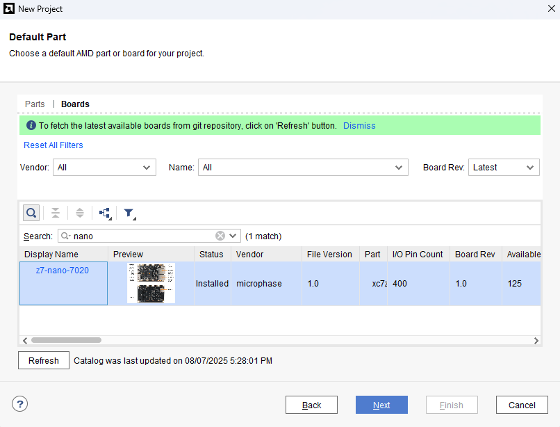

# Z7-Nano 7020 XC7Z020

> ⚠️ **Warning**: This project is currently under development, was not verified yet and may not be fully functional. Stay tuned for updates!

> MicroPhase, Inc. makes no warranties regarding the use of this code or design.
> Code is provided "as is." MicroPhase, Inc. assumes no responsibility
> for any errors that may be present in this code, nor does it make any
> commitment to update the information contained herein.
> MicroPhase, Inc. specifically disclaims any implied warranties,
> including but not limited to warranties of fitness for a particular purpose.

## Overview
This project contains the board definition files required by the **Vitis IDE** for the **Z7-Nano** development board,
which is based on the **Xilinx Zynq-7000 SoC** (XC7Z020) and manufactured by **MicroPhase**. The board features the following:

<div>
    <p align="center" width="100%" height="100%">
        
    </p>
</div>

- 667 MHz dual-core Cortex-A9 processor
- DDR3L memory controller with 8 DMA channels and 4
- High-Performance AXI3 Slave ports
- High-bandwidth peripheral controllers: 1G Ethernet, USB 2.0, SDIO
- Low-bandwidth peripheral controllers: SPI, UART, CAN, I2C
- Programmable from JTAG, Quad-SPI flash, and microSD card
- Programmable logic equivalent to Artix-7 FPGA
  - LUTs: 53,200
  - DSP Slices: 220
  - Logic Cells: 85K
  - Flip-Flops: 106,400
  - Total Block RAM: 4.9Mb
- Analog Mixed Signal (AMS) / XADC: 2x 12 bit, MSPS ADCs with up to 17 Differential Inputs
- Security: AES & SHA 256b Decryption & Authentication for Secure Programmable Logic Config

Full documentation is available
[here](https://fpga-docs.microphase.cn/projects/documentation-of-microphase-fpga-board/en/latest/DEV_BOARD/Z7-NANO/Z7-NANO_Reference_Manual.html)

## Installation
Copy the following directory into your Xilinx tools installation path to install the board.
```bash
cp -r z7-nano-7020/board_files/z7-nano-7020 /opt/Xilinx/2025.1/data/boards/board_files/
```
It should be visible in Vivado:
<div>
    <p align="center" width="100%" height="100%">
        
    </p>
</div>
<div>
    <p align="center" width="100%" height="100%">
        
    </p>
</div>

## XDC (Xilinx Design Constraints)
To generate a `.xdc` file, you need to extract the pin assignments and constraints defined
in `part0_pins.xml` and convert them into standard XDC format. A dedicated script has been
provided for this purpose: `./scripts/xdcgen.py`.

To view usage instructions, run:

```bash
cd ./scripts
./xdcgen -h
```

Once the .xdc file is generated:
1. Open your Vivado block design project.
2. In the **Sources** panel, right-click on **Constraints**.
3. Select **Add Sources** → **Add or Create Constraints**.
4. Add the generated `z7-nano-7020.xdc` file to your project.

This file should be used with caution, as not all constraints may be applicable to the programmable
logic (PL) portion of the board. It is recommended to comment out the entire contents of the file
and then uncomment only the constraints that are relevant to your specific design.

## Examples
The `examples` directory contains several basic resources:
- IP definitions created using the HLS flow,
- dedicated platform definitions for the Z7 Nano board,
- embedded applications for verifying the correctness of the board files.

This folder will be continuously developed to include at least basic manual tests for all fundamental
board functionalities. For more details, refer to the `examples` subdirectory. Each example includes
a separate `README.md` file explaining the basics.
