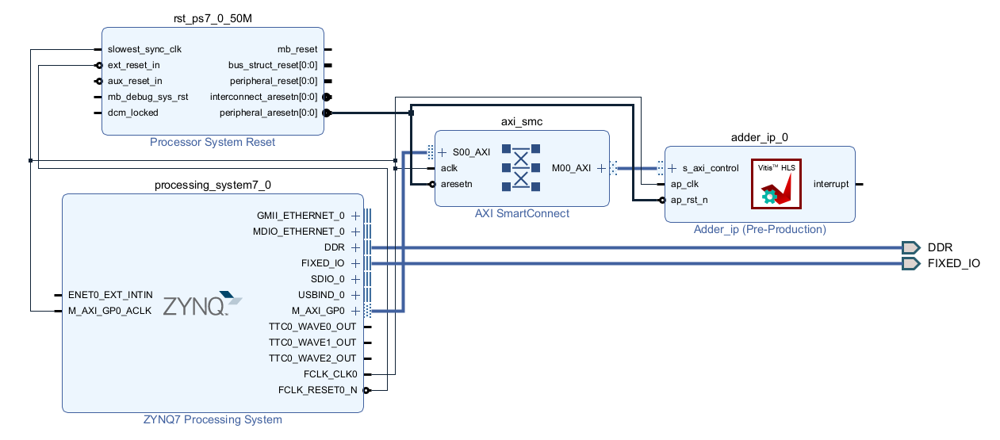

# Z7 Adder Project setup

This folder contains the `.xci` (IP configuration) files, `.bd` (Block Design) files, and the primary `z7_adder_proj.tcl`
script used to recreate the Vivado project. To recreate the project, run:

```bash
vivado -source z7_adder_proj.tcl
```

After execution, the `z7_adder_design` block design should be loaded:

<div>
    <p align="center" width="100%" height="100%">
        
    </p>
</div>

You can modify the design if required, or generate an HDL wrapper and export the hardware definition for use in other projects.